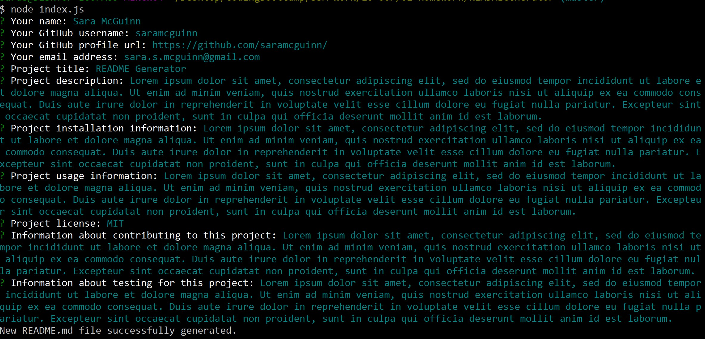
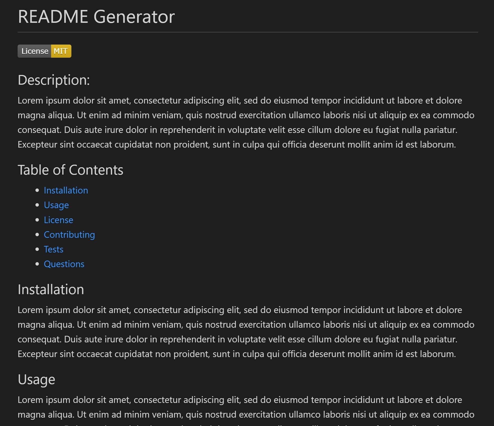

# README Generator
[](https://opensource.org/licenses/MIT)

## Description
This application takes in user input about a project and then generates a README markdown file.

User input is received via inquirer prompts in Node.



The README file includes a clickable table of contents and license badge/information.




For a brief demo video, see https://drive.google.com/file/d/1WLA1wegDDQY8ihx-IRQXdDrlwiXzzsTM/view. 

---

## Installation
This application requires Node.js and npm. It uses built-in Node modules `fs` and `util`, and it also requires installation of the `inquirer` module. To install `inquirer`, simply navigate into the directory where the index.js file is saved and type the following into the command line:

```
npm install inquirer --save
```

---

## Usage
After inquirer is installed, usage is simple. To run the program in Node, type the following into the command line:

```
node index.js
```

Then type in your answers to the prompts. Once all questions are answered, a README markdown file will be generated, populated by your answers.

---

## License
The MIT license is open source. For details, see https://opensource.org/licenses/MIT.

---

## Questions
Please feel free to contact me with questions about this project.

* Name: **Sara McGuinn**
* GitHub: saramcguinn | https://github.com/saramcguinn/
* Email: sara.s.mcguinn@gmail.com
